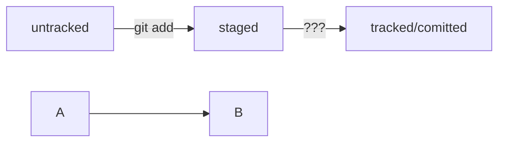

# H1 — заголовок первого уровня, самый большой
## H2 — заголовок второго уровня, поменьше
### H3
#### H4
##### H5
###### H6 — заголовок шестого уровня, самый маленький

Текст над чертой

---

Текст под чертой 

Текст до переноса  
Текст после переноса <br>
Текст после второго переноса 

line

another line  

Если сделать один перенос строки, как в примере ниже, и не поставить два пробела, текст сольётся в одну строку.

Курсив — это *звёздочки* или _подчёркивания_.  
Полужирный шрифт — двойные **звёздочки** или двойные __подчёркивания__.  
Можно совместить выделение **звёздочки и _подчёркивания_**.  
~~Зачёркнутый текст.~~ 

1. Первый пункт нумерованного списка.
2. Второй пункт. 

* первый пункт ненумерованного списка;
* второй пункт ненумерованного списка

- первый пункт ненумерованного списка;
- второй пункт ненумерованного списка

[Яндекс](https://www.yandex.ru) 

[Яндекс](https://www.yandex.ru "Я Yandex!") 

Чтобы оформить текст как код, нужно окружить его тройками косых кавычек — грависов. После первой тройки грависов указывают язык программирования, на котором написан код. В маркдауне есть поддержка синтаксиса почти всех популярных языков и инструментов.  
```bash
ls - la
```
```html
<h1>А я просто текст</h1>
```  
Обратите внимание: вторая тройка тройных кавычек стоит на отдельной строке.

# краткое содержание курса

в git-bash
в c:/users/bonya
.gitconfig - настроить после установки

$ git config --global user.name "ваше имя или ник латиницей" 
$ git config --global user.email ваша электронная почта 

переместиться в папку проекта и выполнить один раз
git init

далее используется
git status

Сначала команда git add сообщает Git, какие именно файлы нужно сохранить и какую их версию. Затем с помощью команды git commit происходит само сохранение.

добавление в репозиторий указаний, какие файлы (и с каким содержимым - оно фиксируется на момент выполнения команды) надо сохранять
git add
git add --all

коммит - фиксация нового состояния файлов
git commit -m "комментарий к версии"
длина коментария очень рекомендуется до 72 символов

история коммитов
git log
git log --oneline

HEAD - синоним хэша последнего (самого нового) коммита

другие команды
git restore
git rm


### как сделать mermaid-схему

```mermaid
%% описание схемы
```
<и тут пустая строка!> 




